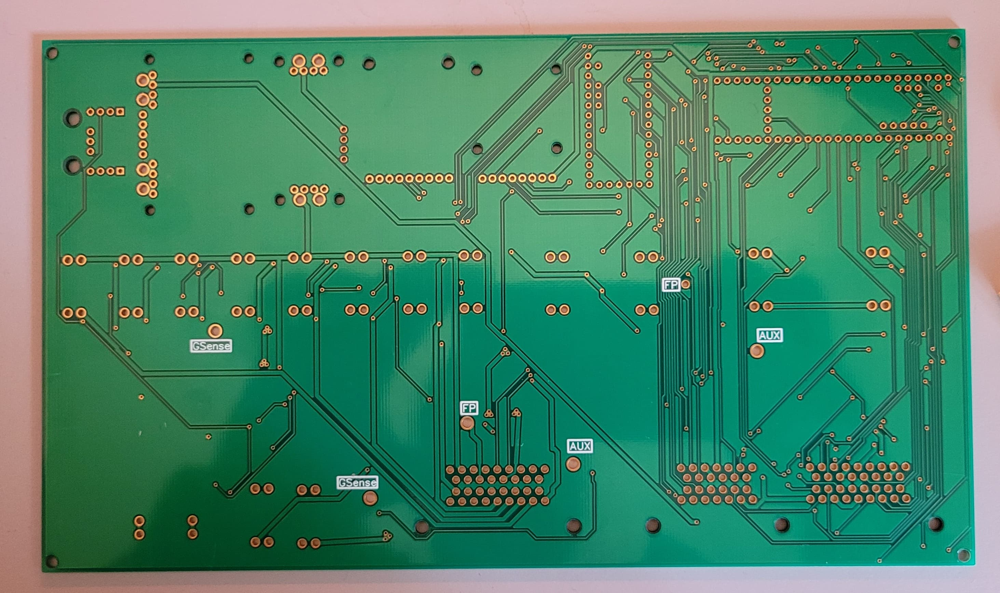

# All-in-One Board | Virginia Tech Motorsports

This repository contains all documentation and material related to [Virginia Tech's Formula SAE team - Virginia Tech Motorsports](https://vtmotorsports.weebly.com/) - All-in-One board for our 2021/2022 internal combustion vehicle.

The AIO board encapsulates several data acquisition features, as well as rules compliant power staging and power distribution, into a single PCB. Note that it is tightly integrated with our Brake-System-Plausibility device which can be found at the repository over [here](https://vtmotorsports.weebly.com/). 

The repository is split into [hardware](./hardware) and [software](./software) subdirectories. The former contains schematics, BOM, etc. Note that I used Diptrace as my PCB design software of choice, and while all critical files for board fabrication/inventory management are available in standard formats (GERBER, pdf's, spreadsheets), the original Diptrace files are included as well. The rest of the team uses Altium, however I'm a stickler for Diptrace - its easy to port between the two. The software directory contains Platform-IO project files that run both the MAIN and DRS microcontrollers on the AIO board. Custom Hardware Abstraction Layers/API's were made in order to make it easy to work with the board's slew of features. Both subdirectories include folders containing all our old revisions, which can be safely ignored unless you are a VTM member or a general busy body.  

If you want to add libraries, please visit the Platform-IO libraries registry and add the dependency into our project's 'platformio.ini' file. [This video](https://www.youtube.com/watch?v=buFKeqbafDI) illustrates this nicely. This file basically configures every option about our project - the serial port baud rate, library dependencies, what board etc were using, everything. Its a very powerful tool. 

Running our microcontrollers with the Arduino bootloader and hardware abstraction layer not only allows us access to a vast array of easy-to-use libraries for various embedded hardware components (saving us dev time), but also allows lesser experienced team members to absorb functionality and hit the ground running with contribution quicker. We suffer from little to nothing when it comes to the drawbacks of using the arduino abstraction layer because 1. we are using proven and optimized hardware by standardizing to the teensy line of microcontrollers and 2. we are not using the stock arduino IDE, rather platform IO which is an extremely rich and ever-expanding IDE for a vast array of embedded processors and development boards, allowing us to easily and reliably integrate custom as well as off-the-shelf open source libraries. [This](https://apprize.best/programming/arduino/10.html) is a nice resource regarding arduino programming and data structures.

## Software Guide

Please read all the code in the /src directories for both the AIO_MAIN_MCU and AIO_DRS_MCU to understand the system thoroughly and before attempting to modify any code. All pin/IO definitions for the microcontrollers are established as macros in a file called "pin_definitions.hpp" in both directories, please study these and compare them with the schematics in the hardware subdirectories. Only use these macros for pin control in the code in order to keep things consistent, clean, and less error prone. Also remember to see header comments in order to match code and hardware compatibility - everything in the top level directories by default should be compatible with the latest hardware revision, which as of writing this is 'DAQ_PDU AIO BOARD REV2'.

In order to get an idea of how to use the various libraries to interact with peripherals on the AIO (SD card, GPS, IMU), read the documentation and example arduino sketches in the lib_dep directory. So for the MAIN MCU this would be [.pio\libdeps\teensy35](./software/AIO_MAIN_MCU/.pio/libdeps/teensy35)

Note that the arduino hardware abstraction layer compiles C++, but in reality most things are in C. The only significant usable C++ features are classes. Absolutely nothing from the C++ standard library should be used as it will wreck your boards memory and probably cause stack fragmentation which will either brick or freeze your board, which will be hard to debug. You can get away with using an std::string or an std::vector here or there but since its such a nasty slippery slope that hits quick stay away from it at all costs. So if you want to use convenient C like data structures I recommend you dont. If you feel like you really must then its a sign your code is probably a tad too complicated for a simple embedded application such as ours. 

I've tried my best to comment as much as possible, but if you have any questions reach out to me at mihirsavadi1@vt.edu.

## TODOS and Notes

- Add pictures of the board to this readme
- Build base classes/API for DRS MCU
- Implement IMU and GPS integration into the [aioMainMCU class](software/AIO_MAIN_MCU/src/aioMainMCU.cpp)
- Implement UART comms between DRS and MAIN MCU's
- Sort out CANBUS in MAIN MCU
- Clean up old revision subdirectories with information regarding what went wrong with them
- Include links to lecture videos describing entire system that we made (to youtube or something)
- Include wire map information here when that is all finalized and hashed out.  